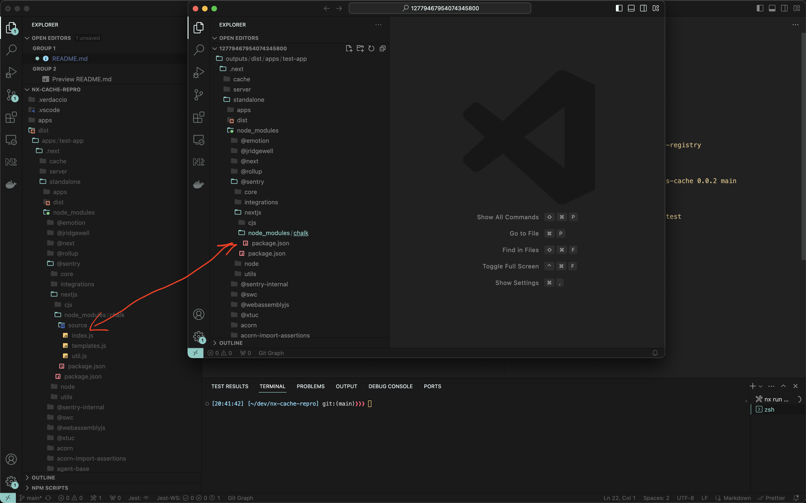

### Steps to reproduce

`npm install`

Then build mock file system cache

`npx nx run nx-fs-cache:build`

Start local registry with 

`nx run @nx-cache-repro/source:local-registry`

publish mock custom cache to local registry

`node tools/scripts/publish.mjs nx-fs-cache 0.0.2 main`

build test-app with mocked cache

`npx nx run test-app:build --runner=test`

check cached result

